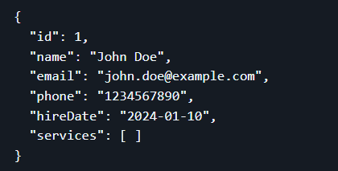
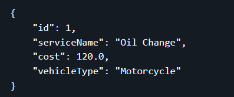
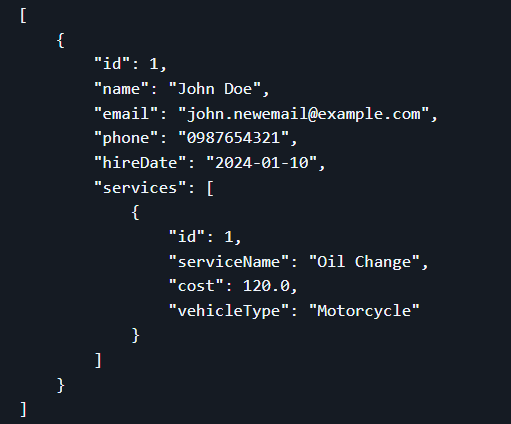
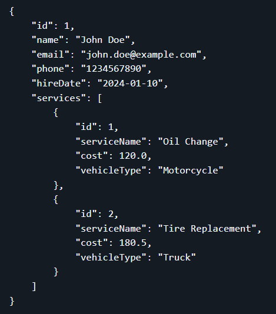
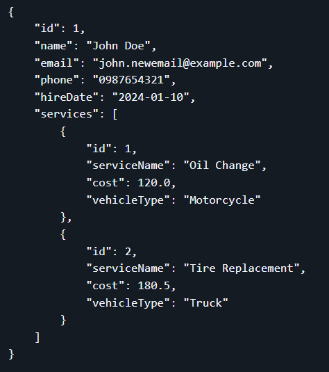

**POST: http://localhost:8080/api/v1/employees**
**Screenshot**

**POST: http://localhost:8080/api/v1/services**
**Screenshot**

**GET: http://localhost:8080/api/v1/employees**
**Screenshot**

**POST: http://localhost:8080/api/v1/services**
**Screenshot**

**GET: http://localhost:8080/api/v1/employees/1**
**Screenshot**

